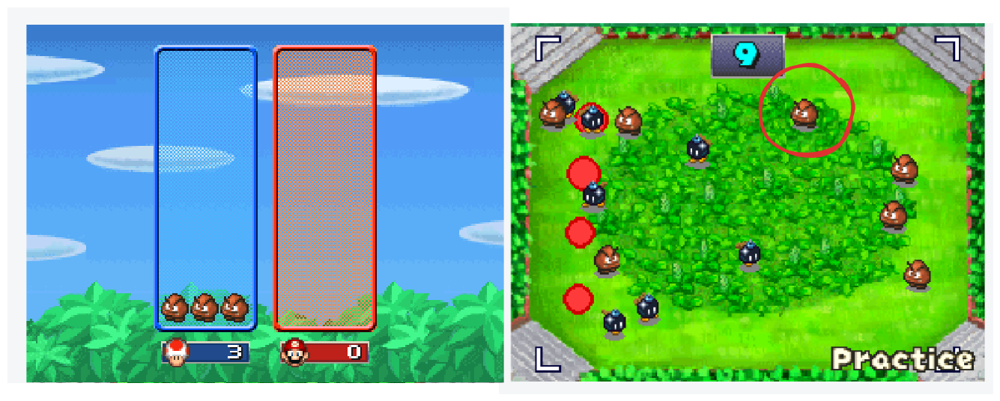

# 🎮 Mario Party AI: Woomba Grangler Master 🤖

Welcome to AI-Mario-Party!! Here we present an AI capable of playing (and winning) Mario Party minigame Woomba Grangler!!!!

<p align="center">

</p>

## 🗃️ Table of Contents- [🎮 Mario Party AI: Woomba Grangler Master 🤖](#-mario-party-ai-woomba-grangler-master-)
- [🎮 Mario Party AI: Woomba Grangler Master 🤖](#-mario-party-ai-woomba-grangler-master-)
  - [🗃️ Table of Contents- 🎮 Mario Party AI: Woomba Grangler Master 🤖](#️-table-of-contents---mario-party-ai-woomba-grangler-master-)
  - [🛠️ Set up](#️-set-up)
  - [🚀 Usage](#-usage)
  - [🩺 Project Roadmap](#-project-roadmap)
  - [👥 Aknowledgements](#-aknowledgements)
  - [📝 License](#-license)

## 🛠️ Set up
[Back to Top](#-mario-party-ai-woomba-grangler-master-)

1. Install DesSmuME on your computer. You can download it from [here](https://desmume.org/download/). You might find this guide useful: [How to play Nintendo DS games on your PC](https://www.youtube.com/watch?v=83Os49uUrq8).

2. Download the ROM of Mario Party DS. You can download it from [here](https://wowroms.com/es/roms/nintendo-ds/mario-party-ds/18177.html).

3. Update the properties file to match your screen display.

4. Clone the repository
```
git clone https://github.com/LoboaTeresa/AI-Mario-Party.git
```

5. Install the requirements. You need Python 3.8.5 or higher.
```
pip install -r requirements.txt
```

1. Train the model (optional). You can skip this step if you want to use the model we have already trained. The code for training your own model can be found [here](docs/train_woomba_detector.ipynb), and the dataset is stored in the ´./assets/det_dataset´ folder. A more detailed explanation can be found in [this](https://github.com/LoboaTeresa/Workshop-COF-23) other repository.


## 🚀 Usage
[Back to Top](#-mario-party-ai-woomba-grangler-master-)

1. Run the game: open Mario Party DS wit

2. Unzip the ´./models/train2.zip´ file.

3. Run the script:
```
python3 main.py
```
A pop up will come up showing a list of available minigames.

1. Start the minigame and immediatelly after, click on the pop up to select the minigame you want to play. Let the AI play for you!

## 🩺 Project Roadmap
[Back to Top](#-mario-party-ai-woomba-grangler-master-)

In the future, we would like to add more minigames. For example:
- [x] Goomba Wrangler
- [ ] Wanted!
- [ ] Trace Cadets
- [ ] Domino Effect

## 👥 Aknowledgements
[Back to Top](#-mario-party-ai-woomba-grangler-master-)

Muchas gracias a [Ceuta Open Future](https://ceuta.openfuture.org/) por organizar cada año el #HackatonCOF y por haber contado conmigo para los talleres de esta edición. Me gustaría mandar una mención especial a [Diego Ewokcillo](https://github.com/ewokcillo) y a [Paola Castaño](https://www.linkedin.com/in/paolacbarroso/?originalSubdomain=es). ¡Gracias por todo!

This repository was inspired by [CodeNoodles](https://www.youtube.com/@CodeNoodles). Thanks!

## 📝 License
[Back to Top](#-mario-party-ai-woomba-grangler-master-)

[MIT License](./LICENSE)